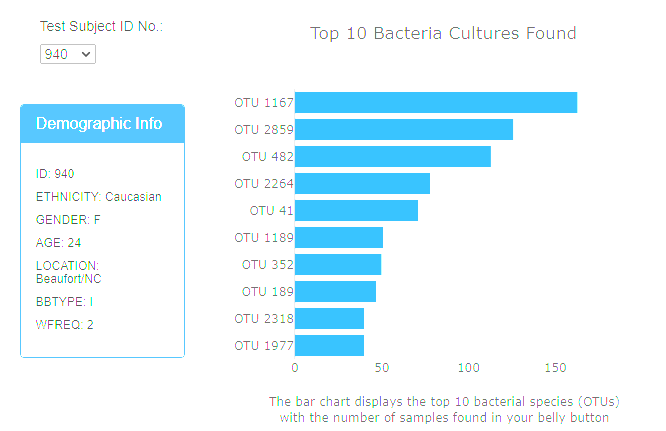
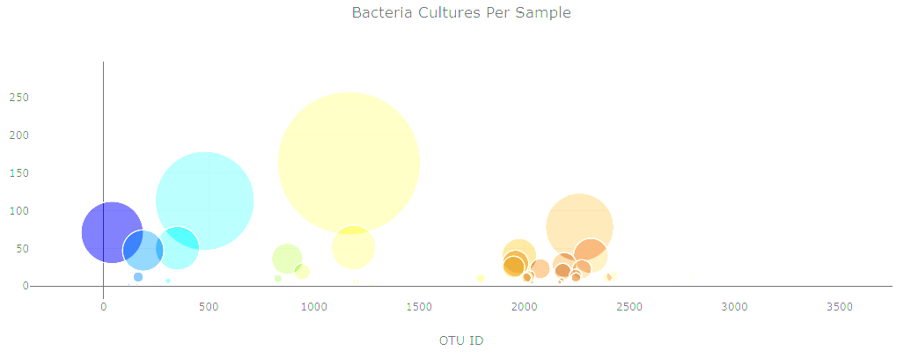
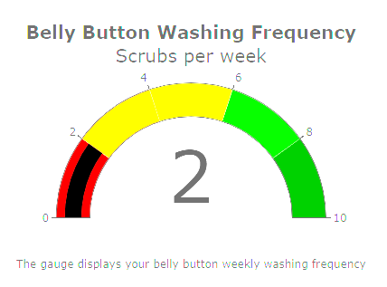
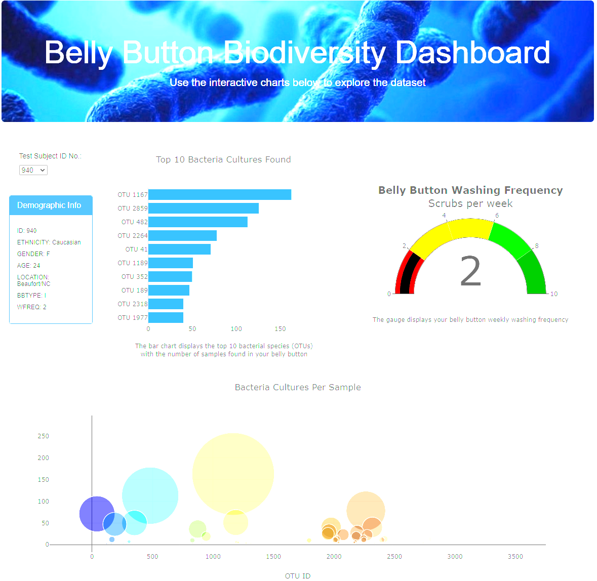

# Belly-Button-Biodiversity

## Background

We have a set of data ("sample.json") of a completed panel for demographic information and now needs to visualize (via a Dashboard and Charts) the bacterial data for each volunteer.

As per instruction, we will select ID # 940 for the images created on the Images folder.

## Objectives

### Deliverable 1a - Create a Horizontal Bar Chart using Plotly.js

Use Plotly.js to build interactive charts for the dashboard, using JavaScript, Plotly and D3.js to create a horizontal bar chart to display the top 10 bacterial species (OTUs) when an individual's ID is selected from the dropdown menu on the webpage.

The horizontal bar chart will display:
	* Top 10 bacterial species (otu_ids) in descending order
	* The sample values for the individual selected

### Deliverable 2: Create a Bubble Chart

* Create a Bubble Chart that uses data from the samples route (`/samples/<sample>`) to display each sample
    * Use `otu_ids` for the x values
    * Use `sample_values` for the y values
    * Use `sample_values` for the marker size
    * Use `otu_ids` for the marker colors
    * Use `otu_labels` for the text values

### Deliverable 3: Create a Gauge Chart

* Displays the individual weekly washing frequency's value
* Display the value as a measure from 0-10 on the progress bar in the gauge chart when an individual ID is selected from the dropdown menu.

### Deliverable 4: Full Page

* Update all of the plots any time that a new sample is selected

